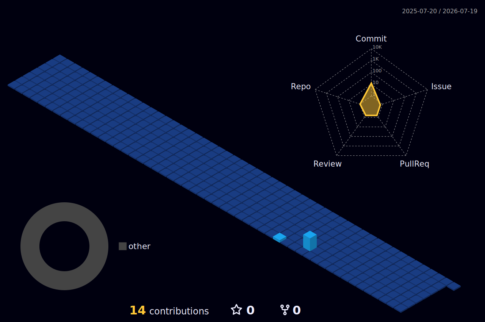

<h1 align="center">
Hi , I'm TTTheheheh

  

---

### 📊 GitHub Analytics

  
  

### 🛠️ Tech Stack & Tools

  

 
<!-- repo: https://github.com/DenverCoder1/readme-typing-svg -->

<!-- Đếm lượt xem đang hoạt động rất tốt -->

 
   

<picture></picture> About me

<picture> </picture>

:school: I am a student My School

:technologist: I love using Software as a solution for every Problem.

:nerd_face: Always learning new things.

:boom: You can visit My fb.

<picture>  </picture> Connect with me

<picture>  </picture> Programming Languages

&emsp;

&emsp;

&emsp;

&emsp;

<picture>   </picture> Software

&emsp;

&emsp;

&emsp;

&emsp;

&emsp;

&emsp;

&emsp;

&emsp;

&emsp;

&emsp;

&emsp;

&emsp;

&emsp;

<picture>  </picture> Developer Tools

&nbsp;&nbsp;

 Tools

&nbsp;&nbsp;

&nbsp;&nbsp;

<picture>   </picture> Operating Systems

&emsp;

<!-- repo: https://github.com/kittinan/spotify-github-profile -->

Spotify Playing 🎧

<!-- repo: https://github.com/piyushsuthar/github-readme-quotes -->

<a href="https://github.com/piyushsuthar/github-readme-quotes"> 

<picture>   </picture> Github Stats

<!-- repo: https://github.com/DenverCoder1/github-readme-streak-stats -->

<h3> 🔥 Streak Stats</h3>

<h3>🧠 LeetCode Stats</h3>

<!-- repo: https://github.com/JacobLinCool/LeetCode-Stats-Card -->

<!-- repo: https://github.com/KevzPeter/Leetcode-Badge-Showcase -->

<!-- repo: https://github.com/anuraghazra/github-readme-stats -->

<h3>💻 GitHub Profile Stats</h3>

<a href="https://github.com/anuraghazra/github-readme-stats">

" height="192px"/>

</a>

<b>Note:</b> Top languages is only a metric of the languages my public code consists of and doesn't reflect experience or skill level.

<!-- repo: https://github.com/Ashutosh00710/github-readme-activity-graph -->

<h3>⚡ Recent GitHub Activity</h3>

<!-- repo: https://github.com/ryo-ma/github-profile-trophy -->

 <h3> :trophy: Git profile Trophies </h3>

<!-- repo: https://github.com/anuraghazra/github-readme-stats -->

<h3> :open_file_folder: My Repositories </h3>

  

🌆 My 3D Contributions City

